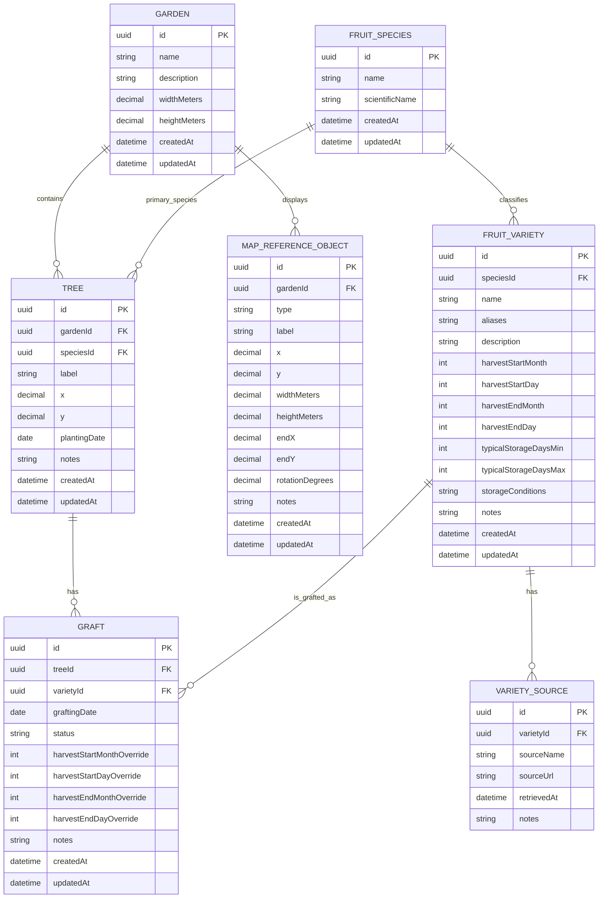

# Architecture

## Scope

Fruit Tree Garden is a single-user garden-management application designed so
that gardens and users can become multi-tenant later. The frontend is an Angular
static application for GitHub Pages. The backend is a separate NestJS REST API
using PostgreSQL and Prisma.

The garden map is a schematic, metric-coordinate representation of a plot. It
contains functional tree markers and optional visual reference objects such as
buildings and fences. Reference objects have no effect on harvest, graft, or
storage calculations.

## Domain model

- **Garden**: a plot, with a name, description, width, and height in metres.
- **FruitSpecies**: a reusable species catalogue, such as Apple or Pear.
- **FruitVariety**: a cultivar belonging to one species, with approximate
  harvest and storage information.
- **Tree**: a physical tree in one garden with one primary species and a
  position on the garden map.
- **Graft**: a particular variety grafted onto a particular tree. It can adjust
  the variety's approximate harvest window for that tree only.
- **VarietySource**: optional attribution for agricultural information recorded
  against a variety.
- **MapReferenceObject**: a visual-only map object. A building is represented
  by a rectangle; a fence or another linear landmark is represented by a line.

Harvest-calendar entries are derived at request time from `Tree`, `Graft`, and
`FruitVariety`; they are not persisted as static calendar records.

### Entity relationship diagram



### Map reference objects

`MapReferenceObject.type` initially supports:

- `BUILDING`: uses `x`, `y`, `widthMeters`, `heightMeters`, and optional
  `rotationDegrees`.
- `FENCE`: uses `x`, `y` as its start and `endX`, `endY` as its end.

Coordinates use the same metre-based coordinate system as trees. A reference
object must stay inside its garden boundaries; both fence endpoints must be
inside those bounds. Reference objects do not prevent tree placement or create
spatial exclusion zones in the first version.

## Domain rules

1. A garden has many trees and many visual reference objects.
2. A tree belongs to exactly one garden and has one primary species.
3. A graft belongs to exactly one tree and references exactly one variety.
4. A graft's variety must have the same species as its tree.
5. A variety may be grafted onto many trees and may exist without a graft.
6. Tree coordinates must be within the dimensions of its garden.
7. Deleting a tree deletes its grafts, but never the global variety definition.
8. A variety in use by a graft cannot be deleted silently.
9. Deleting a garden deletes its trees and map reference objects; this is an
   explicit destructive action in the UI.
10. Species names are unique. Variety names are unique within a species.

Approximate harvest periods are stored as month/day pairs, not timestamps. This
represents agricultural concepts such as "10-25 September" without a fictitious
year or timezone. Effective graft harvest dates use the graft override where it
is complete; otherwise they use the variety's values. Storage information and
harvest windows must always be displayed as approximate.

## REST API

All write endpoints validate IDs, string lengths, enum values, dates, and map
coordinates. NestJS controllers delegate business rules and harvest calculation
to services.

| Resource | Routes |
| --- | --- |
| Gardens | `GET/POST /gardens`, `GET/PATCH/DELETE /gardens/:gardenId` |
| Trees | `GET/POST /gardens/:gardenId/trees`, `GET/PATCH/DELETE /trees/:treeId` |
| Tree position | `PATCH /trees/:treeId/position` with `{ x, y }` |
| Map objects | `GET/POST /gardens/:gardenId/map-objects`, `GET/PATCH/DELETE /map-objects/:objectId` |
| Species | `GET/POST /species`, `GET/PATCH/DELETE /species/:speciesId` |
| Varieties | `GET/POST /varieties`, `GET/PATCH/DELETE /varieties/:varietyId` |
| Variety sources | `GET/POST /varieties/:varietyId/sources`, `DELETE /variety-sources/:sourceId` |
| Grafts | `GET/POST /trees/:treeId/grafts`, `GET/PATCH/DELETE /grafts/:graftId` |
| Harvest calendar | `GET /harvest-calendar?gardenId=&month=&speciesId=&treeId=&varietyId=` |

`GET /trees/:treeId` returns the tree with its species, grafts, varieties, and
their harvest and storage information. `GET /harvest-calendar` returns derived
entries with a tree, variety, effective approximate harvest window, and typical
storage information.

## Angular screens

```text
App shell
|-- Gardens
|   |-- Garden list / initial garden creation
|   |-- Garden overview
|   |   |-- Garden map
|   |   |   |-- tree markers
|   |   |   |-- building and fence reference objects
|   |   |   |-- map-object editor
|   |   |   |-- selected-tree details panel
|   |   |   `-- keyboard-accessible tree and object list
|   |   `-- Garden settings dialog
|   `-- Tree editor
|       |-- base tree properties and coordinates
|       `-- graft list and graft editor
|-- Varieties
|   |-- Variety catalogue with species filter
|   `-- Variety detail/editor
|       |-- approximate harvest period
|       |-- typical storage information
|       `-- information sources
`-- Harvest calendar
    |-- month view
    |-- chronological list/timeline view
    `-- filters: species, tree, variety
```

The map uses SVG or HTML/CSS rather than a GIS library. Trees remain interactive
and accessible through a companion list; buildings and fences provide visual
orientation only. The map editor offers a distinct "add reference object" flow
so that users do not confuse it with adding a tree.

## Frontend structure

```text
apps/frontend/src/app/
|-- core/                 # API client, config, global error handling
|-- shared/               # reusable UI, models, formatting helpers
`-- features/
    |-- gardens/          # garden settings and map reference objects
    |-- trees/            # tree and graft editing
    |-- varieties/        # species, varieties, sources
    `-- harvest-calendar/ # derived calendar and filters
```

## Backend structure

```text
apps/backend/src/modules/
|-- gardens/
|-- trees/
|-- map-objects/
|-- species/
|-- varieties/
|-- grafts/
`-- harvest/
```

The Prisma schema owns persistence and foreign-key deletion rules. Any future
schema implementation requires a version-controlled Prisma migration.
